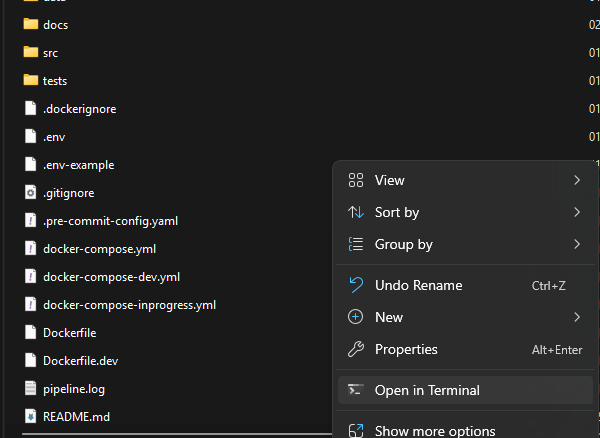
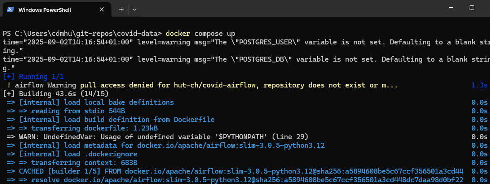
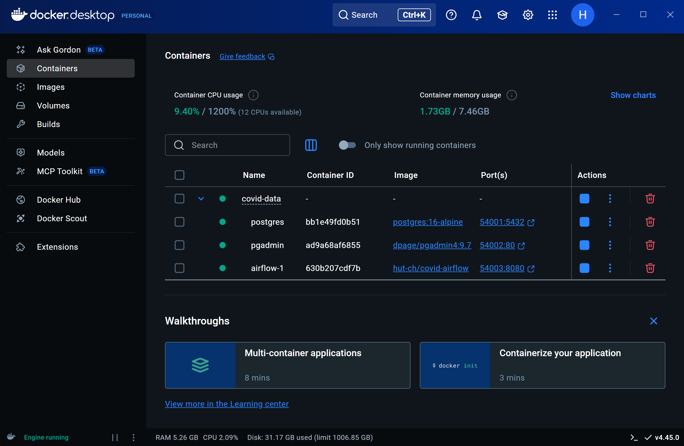
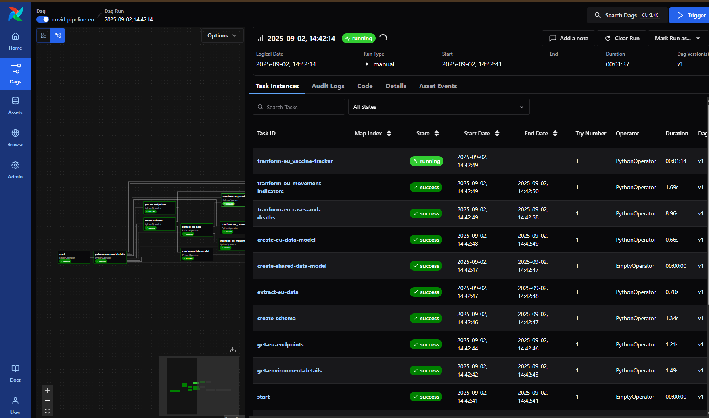
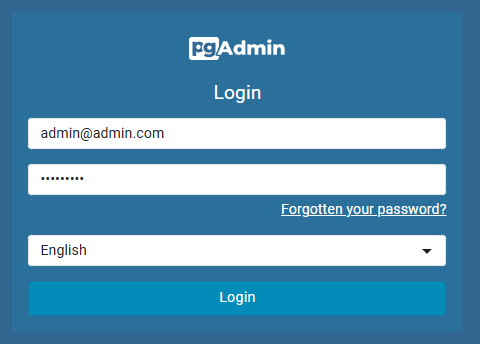
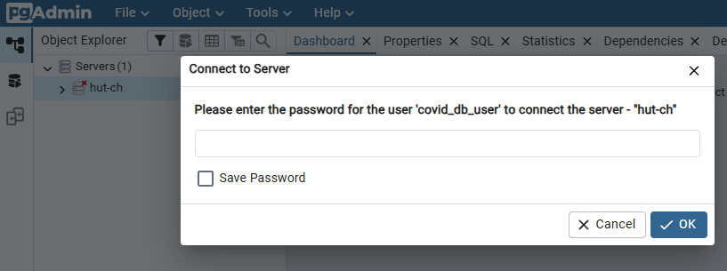
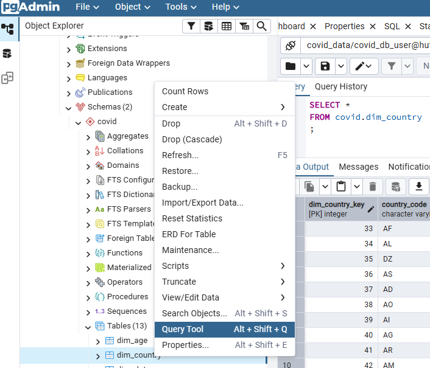

# Covid Data
Project extracts EU and UK covid data from
- add links

data is then transformed and loaded into a reporting schema

## Documentation
1. [Prerequisites](#prerequisites)
1. [Quickstart](#quickstart)
1. Technology Stack
    - [Apache Airflow](/docs/tech-stack/airflow.md)
    - [Postgres](/docs/tech-stack/postgres.md)
    - [PG Admin 4](/docs/tech-stack/pgadmin.md)
    - Metabase
1. Project Structure
1. Source Data
    - [EU Datasets](/docs/eu-datasets.md)
    - [UK Datasets](/docs/uk-datasets.md)
1. ETL Pipeline
    - [EU](/docs/eu_pipeline.md)
    - [UK](/docs/uk_pipeline.md)
1. Cusomisiation
    - [Environment Variables](/docs/environment-variables.md)
    - PG Admin
1. [Troubleshooting](/docs/troubleshooting.md)

## Prerequisites
This project uses a set of docker containers in order to oarchesteate and store the data. Therefore is not already installed it is recommended to use [Docker Desktop](https://www.docker.com/products/docker-desktop/) to run and mange the containers.

Optionally if using [VS Code](https://code.visualstudio.com/), the project comes with a configured dev container that can be started from within VS Code. Ensure the [Remote Developement](https://marketplace.visualstudio.com/items?itemName=ms-vscode-remote.vscode-remote-extensionpack) extension is installed thenyou can [clone the repository](https://learn.microsoft.com/en-us/azure/developer/javascript/how-to/with-visual-studio-code/clone-github-repository?tabs=activity-bar) and start the container.

## Quickstart

1. Clone/download repository
   - either [clone the repository](https://docs.github.com/en/repositories/creating-and-managing-repositories/cloning-a-repository) or at the top of the page click the Green ``Code`` button then select ``Download Zip`` to download the repository and unzip
1. Create ``.env`` file
    - Navigate to the location you have cloned/downloaded the repository
    - Within the root folder rename ``.env-example`` to ``.env``
1. Start the containers
    - Ensure docker is running (bottom left corner of docker desktop check for ``Engine runnning``)
    - Open a terminal/command prompt and navigate to the main folder of the repository. If on windows right click in the folder and select ``Open in Termianl``.  
    
    - inside the terminal type ``docker compose up`` and the containers should start to build and run
    
    - once started the container should now be visible in docker desktop and the terminal window can be closed
    
1. Run pipeline in Airflow
    - Navigate to http://localhost:54003
    - You will be automatically logged in to Apache Airflow
    - Select ``Dags`` on the left
    - Click ``covid-pipeline-eu``
    - Click ``Trigger`` in the top right, the ``Trigger`` again in the popup
    - You can monitor the progress of the pipeline by clicking ``Runs`` and selecing the running instance
    
    - You can view the ``logs`` of each ``task`` to see what each is performing
1. Query processed data using PGAdmin
    - Navigate to http://localhost:54002 and login with below credentials
    - Username: ``admin@admin.com``
    - Password:``pgadminpw``  
    
    - Click on servers and enter the follwing password for ther connection that has been preconfigured
    - Password: ``covidpw``  
    
    - Expand the covid schema, right click and select ``Query Tool`` or click ``Alt + Shift + Q`` to bring up the query window to query the processed data.  
    
1. View Analysis
    - ``TODO:`` create analysis using Metabase
