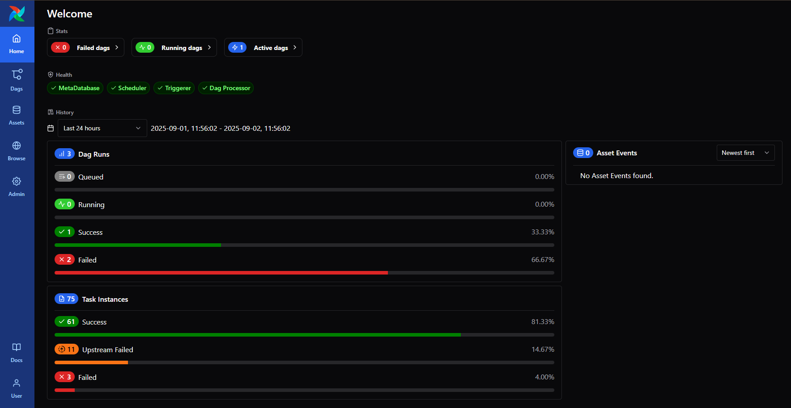
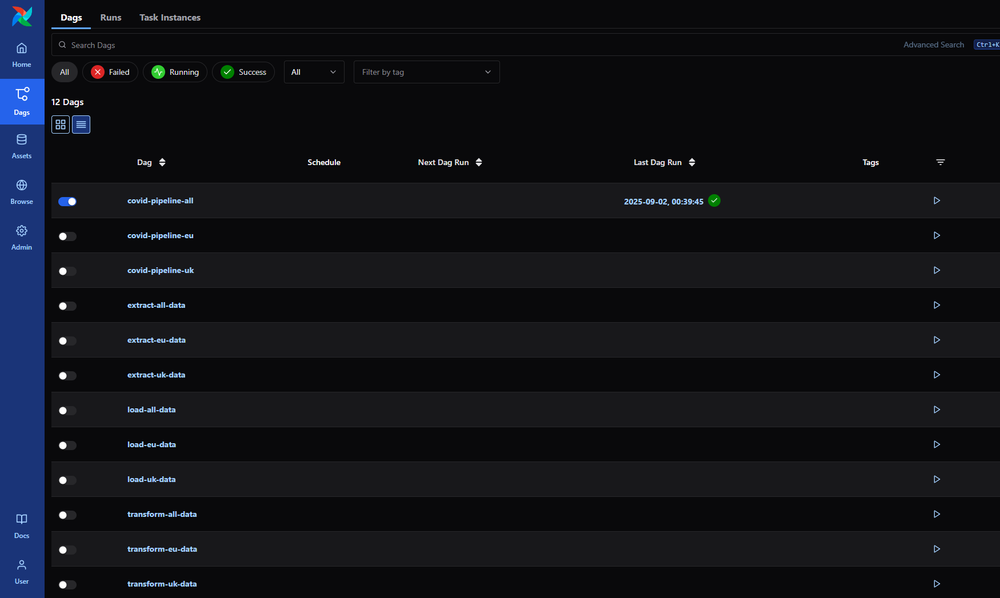

# Apache Airflow

Apache Airflow is being used as the Data Orchestration tool for this project, for more information oin airflow see [Apache Airflow 3.0.5](https://airflow.apache.org/docs/apache-airflow/3.0.5/index.html).

The Airflow instance configured as part of this project can be accessed by default form http://localhost:54003. the port can be changed by updating the ``AIRFLOW_WEB_PORT`` variable in the ``.env`` file. For more information on configuring environment variables see [environment-variables](environment-variables.md)

## Configuration
For simplicity the container has been configured to run in standalone mode

## DAGS
A DAG is a model that encapsulates everything needed to execute a workflow. Some DAG attributes include the following:

- Schedule: When the workflow should run.
- Tasks: tasks are discrete units of work that are run on workers.
- Task Dependencies: The order and conditions under which tasks execute.
- Callbacks: Actions to take when the entire workflow completes.
- Additional Parameters: And many other operational details.

[[source]](https://airflow.apache.org/docs/apache-airflow/3.0.5/index.html#dags) Airflow 3.0.5 documentation

There are 12 example DAGS created within the project broken down into 4 main areas:
1. Full pipeline execution
    - covid-pipeline-all
    - covid-pipeline-eu
    - covid-pipeline-uk
1. Extract pipeline only
1. Transformation pipeline only
1. Load pipeline only
